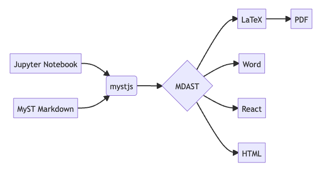

# Introduction

Jupyter Book has been rebuild from ground up using the MyST engine [@Jupyter2025]. This allows to export content in multiple output formats including HTML, PDF and docx. In this paper we present an overview of the possibilities and demonstrate its working.

## Background
Some background information about Jupyter Book and its features, like exporting to multiple formats as indicated in {numref}`fig-diagram`.

:::{figure} ../figures/diagram.*
:label: fig-diagram
:alt: Some figure

Some figure
:::

+++{"no-pdf":true}
:::{figure} ../figures/delft.*
:label: fig-delft
:alt: picture of the TUD

A figure that is in the website but not in the PDF version.
:::
+++

This text should appear in all formats.

:::{raw} latex
\begin{figure}
\centering
\only<1>{\includegraphics[width=0.5\textwidth]{figures/tudelft-dark.png}}
\caption{This picture should appear only in beamer}
\end{figure}
:::

This is a text that should appear in all the website, PDF and beamer presentation.

:::{raw} html

This is a block of text that should appear only on the website.

:::

:::{raw} latex
This is a block of text that should appear only in the beamer presentation.
:::

:::{div} .pdf-only
This is a block of text that should appear only in the PDF.
:::

:::{raw} latex
\begin{figure}
\centering
\only<1>{\includegraphics[width=0.5\textwidth]{figures/delft.png}}
\caption{This is a picture that would appear only in the beamer presentation.}
\end{figure}
:::

